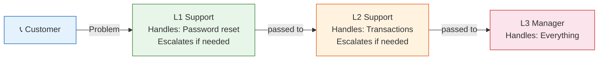

# ⛓️ Chain of Responsibility Pattern

## Customer Support — Level 1, Level 2, Level 3

---

### 📖 The Story

You call your bank's customer support. Your problem is simple — "I forgot my password."

- **Level 1 (Junior Support)**: "I can help reset your password. Done!"
- You call back with another problem — "Someone made a fraudulent transaction."
- **Level 1**: "I can't handle this. Let me transfer you to Level 2."
- **Level 2 (Senior Support)**: "I can investigate and issue a refund."
- You call back with a bigger problem — "I want to close my account and sue the bank."
- **Level 2**: "This is beyond me. Let me transfer you to Level 3."
- **Level 3 (Manager)**: "I'll handle this personally."

Each level looks at the request. If they can handle it, they do. If not, they pass it up the chain. The request travels until someone handles it.

That's the Chain of Responsibility pattern.

**In software terms: Avoid coupling the sender of a request to its receiver by giving more than one object a chance to handle the request. Chain the receiving objects and pass the request along until an object handles it.**

---

### 🖌️ The Diagram

---

### ✅ When to Use

- **When more than one object can handle a request, and the handler isn't known upfront**
- **When you want to issue a request to one of several objects without specifying the receiver**
- **When handlers can be added/removed dynamically**

### ⚖️ Pros vs Cons

| ✅ Pros | ❌ Cons |
|---------|--------|
| Decouples sender from receiver | Request might go unhandled |
| Easy to add/remove handlers | Can be hard to debug (which handler handled it?) |
| Follows Single Responsibility | Recursion can cause stack issues |