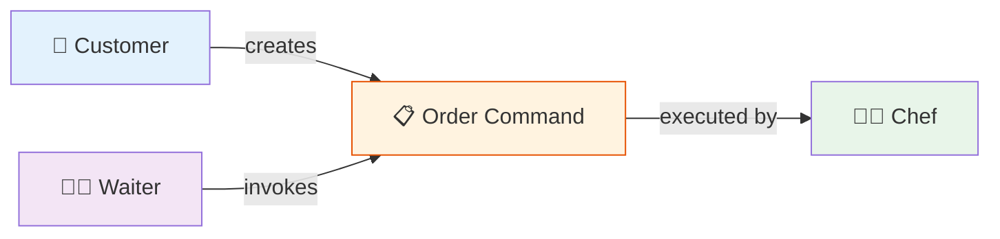

# 📋 Command Pattern

## The Waiter Taking Your Order

### 📖 The Story
You're at a restaurant. You tell the waiter what you want. The waiter writes it on a pad (a command). 
The order can be queued with others, and later the chef executes them all.
The waiter doesn't care WHAT you ordered — just writes it down and passes it along.

**In software terms: Encapsulate a request as an object, letting you parameterize clients with queues, logs, and support undoable operations.**

### 🖌️ Diagram

### ✅ When to Use
- When you need to queue, log, or undo operations
- When you want to parameterize objects with actions
- When you need to support transactions/rollbacks

### ⚖️ Pros vs Cons
| ✅ Pros | ❌ Cons |
|---------|--------|
| Decouples sender from executor | Many small command classes |
| Commands can be queued/logged/undone | |
| Easy to add new commands | |