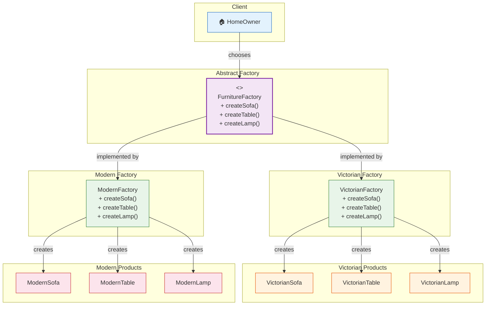

# 🏭 Abstract Factory Pattern

## The Furniture Store That Sells Matching Sets

---

### 📖 The Story

Imagine you walk into a furniture store. You want to redecorate your entire house. You see a beautiful Victorian sofa. You buy it. Then you find a Modern coffee table. You buy that too. Then you find a Scandinavian lamp. You buy it.

You get home and... nothing matches. The Victorian sofa looks ridiculous next to the Modern table. The Scandinavian lamp looks lost. Your house looks like a furniture store exploded.

What you *should* have done is go to a store that sells **entire matching sets**. "I want Victorian style" — and you get the Victorian sofa, Victorian table, and Victorian lamp, all in one go. "I want Modern style" — same thing, but Modern.

That's the Abstract Factory pattern.

**In software terms: Provide an interface for creating families of related objects without specifying their concrete classes.**

---

### 🖌️ The Diagram



---

### 🧠 How It Works

The Abstract Factory is like a **super-factory** that creates other factories. It has:

1. **Abstract Factory** — An interface that declares methods for creating each product in the family
2. **Concrete Factory** — Implements those methods to create specific product variants
3. **Abstract Products** — Interfaces for each type of product (Sofa, Table, Lamp)
4. **Concrete Products** — Specific implementations (Victorian Sofa, Modern Sofa, etc.)
5. **Client** — Uses only the abstract interfaces, never concrete classes

The key insight: **The client never creates products directly**. It asks the factory: "Give me a sofa, a table, and a lamp." The factory returns matching products. The client doesn't know if they're Victorian or Modern — and it doesn't care.

---

### 💻 The Code (Key Parts)

```java
// Abstract Factory
interface FurnitureFactory {
    Sofa createSofa();
    Table createTable();
    Lamp createLamp();
}

// Abstract Products
interface Sofa { void relax(); }
interface Table { void putThingsOn(); }
interface Lamp { void light(); }

// Concrete Factory 1
class VictorianFactory implements FurnitureFactory {
    public Sofa createSofa() { return new VictorianSofa(); }
    public Table createTable() { return new VictorianTable(); }
    public Lamp createLamp() { return new VictorianLamp(); }
}

// Concrete Factory 2
class ModernFactory implements FurnitureFactory {
    public Sofa createSofa() { return new ModernSofa(); }
    public Table createTable() { return new ModernTable(); }
    public Lamp createLamp() { return new ModernLamp(); }
}
```

**What's happening?**
- The client says "I want a Victorian look" → creates `VictorianFactory`
- The client says "createSofa()" → gets a Victorian Sofa
- The client says "createTable()" → gets a Victorian Table
- Everything matches! No accidental mixing of styles.

---

### ✅ When to Use

- **When products must be used together (they must match)**
- **When you want to provide a library of products without exposing implementation details**
- **When you have families of related products that change together**
- **When you want to enforce consistency among products**

### ❌ When NOT to Use

- **When adding a new product means changing the abstract factory interface** (all factories must change)
- **When you only have one product family** — Simple Factory or Factory Method is enough
- **When the products don't need to be used together** — You're adding complexity for no reason

### ⚖️ Pros vs Cons

| ✅ Pros | ❌ Cons |
|---------|--------|
| Products from the same factory are guaranteed to match | Hard to add new product types (must update all factories) |
| Isolates concrete classes from client | Can make code more complex |
| Makes swapping product families easy | More upfront design needed |
| Follows Open/Closed principle for adding families | Many interfaces and classes |

### 💡 Senior Wisdom

*"The first time I used Abstract Factory was for a UI library. We had Windows, Mac, and Linux — three 'families' of UI components. Each family had buttons, text fields, checkboxes. The Abstract Factory ensured that on Windows, you got Windows-style buttons. On Mac, Mac-style buttons. When we switched from Windows to Mac, we just swapped the factory. ONE line changed. Not 500. That's the power of Abstract Factory — it makes 'switching families' a one-line operation."*