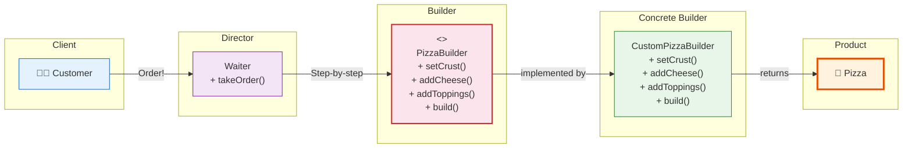

# 🏗️ Builder Pattern

## Building a Custom Pizza, One Topping at a Time

---

### 📖 The Story

Imagine you walk into a pizza place. You want a pizza. But not *any* pizza. You want:
- A thin crust
- With tomato sauce
- Mozzarella cheese
- Pepperoni
- Mushrooms
- Extra cheese (because why not)
- Olives

Now imagine the poor pizza chef. Do they have a constructor that takes 15 parameters? 

```java
Pizza pizza = new Pizza("thin", "tomato", "mozzarella", true, true, true, false, false, true, false);
```

What's that third `true`? Nobody knows. And what if you forget the olives? Too bad, you're eating a sad pizza.

What you *actually* want is: **Build the pizza step-by-step, one topping at a time.**

"Set the crust. Good. Add sauce. Good. Add cheese. Good. Now pepperoni? Yes. Mushrooms? Yes. Olives? Yes. Done!"

That's the Builder pattern.

**In software terms: Separate the construction of a complex object from its representation, so the same construction process can create different representations.**

---

### 🖌️ The Diagram



---

### 🧠 How It Works

The Builder has four parts:

1. **Product** — The complex object you're building (Pizza)
2. **Builder** — An interface with methods for each part of the product
3. **Concrete Builder** — Implements the builder methods, keeps track of the product
4. **Director** — Controls the building process (optional, but common)

The key insight: **The product is built in steps, and the steps can be called in different orders to create different products.** The builder keeps the intermediate state until you call `build()` to get the final product.

This solves the "constructor with 15 parameters" problem beautifully.

---

### 💻 The Code (Key Parts)

```java
// The Product
class Pizza {
    private String crust;
    private String sauce;
    private List<String> toppings = new ArrayList<>();
    
    // Setters only — no constructor explosion!
}

// The Builder
interface PizzaBuilder {
    PizzaBuilder setCrust(String crust);
    PizzaBuilder addCheese();
    PizzaBuilder addTopping(String topping);
    Pizza build();
}

// The Concrete Builder
class CustomPizzaBuilder implements PizzaBuilder {
    private Pizza pizza = new Pizza();
    
    public PizzaBuilder setCrust(String crust) {
        pizza.setCrust(crust);
        return this;  // ← return this enables METHOD CHAINING
    }
    
    public PizzaBuilder addCheese() {
        pizza.setCheese(true);
        return this;
    }
    
    public PizzaBuilder addTopping(String topping) {
        pizza.addTopping(topping);
        return this;
    }
    
    public Pizza build() {
        return pizza;
    }
}

// Usage — so clean, it brings a tear to your eye
Pizza pizza = new CustomPizzaBuilder()
    .setCrust("thin")
    .addCheese()
    .addTopping("pepperoni")
    .addTopping("mushrooms")
    .build();
```

**What's happening?**
- Each method returns `this` — you can chain calls
- You build step-by-step, and nobody gets confused
- The `build()` method at the end gives you the final product

---

### ✅ When to Use

- **When an object has many optional fields or complex construction**
- **When you want to avoid constructors with too many parameters**
- **When the same construction process should create different representations**
- **When you want to enforce immutability** (build creates new object each time)

### ❌ When NOT to Use

- **When objects are simple (2-3 fields)** — Just use a constructor
- **When you don't need different representations** — It's overkill
- **When the number of parameters is small and stable**

### ⚖️ Pros vs Cons

| ✅ Pros | ❌ Cons |
|---------|--------|
| Clean, readable object creation | More code than simple constructor |
| Objects always built in valid state | Builder can be misused (forgetting to call build) |
| Parameters are named (via method names) | Duplication between builder and product |
| Great for immutable objects | |
| Step-by-step construction | |

### 💡 Senior Wisdom

*"I once inherited a class with a constructor that had 23 parameters. TWENTY-THREE. Half were optional. The documentation said 'pass null if you don't want it.' The code was a minefield of NullPointerExceptions. I introduced a Builder, and suddenly the code was readable. People started actually using the class instead of avoiding it. If your constructor needs more than 4-5 parameters, it's time for a Builder. Your future self will thank you."*