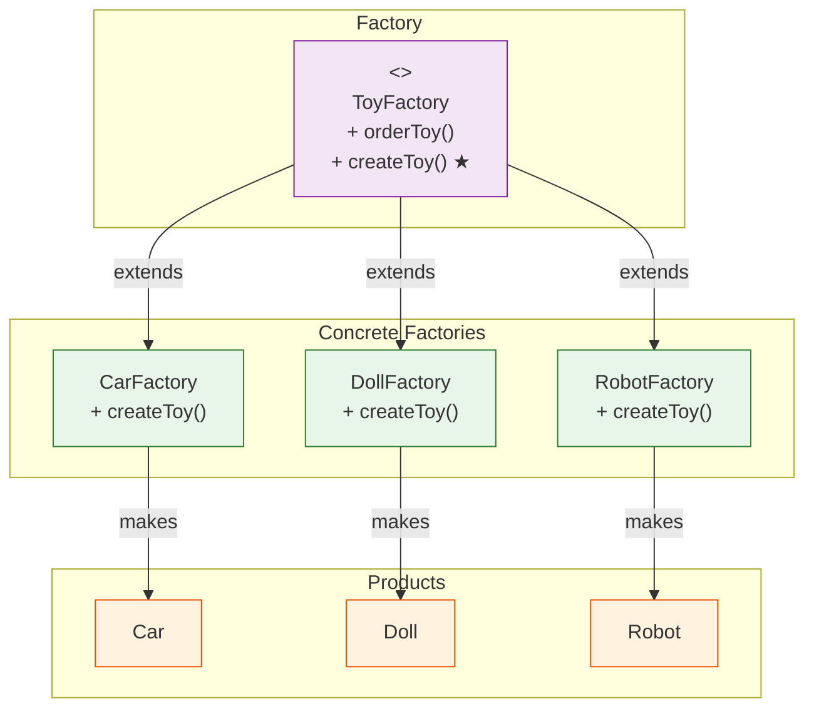

# 🏭 Factory Method Pattern

## The Toy Factory That Makes Anything

---

### 📖 The Story

Imagine you own a toy factory. Kids come in and say "I want a toy!" But here's the thing — you never know *which* toy they'll ask for. One kid wants a car. Another wants a doll. A third wants a robot.

If you build a factory that ONLY makes cars, you're in trouble when someone asks for a doll. If you build a factory that makes EVERYTHING at once, it's a mess. What do you do?

You build a **generic factory process** — a method called `createToy()`. The factory says, "I don't know what toy you want. But my **sub-factories** know." So you have:
- A `CarFactory` that overrides `createToy()` to make a car
- A `DollFactory` that overrides `createToy()` to make a doll
- A `RobotFactory` that overrides `createToy()` to make a robot

The parent factory defines *how* to make a toy (package it, price it, ship it). But the *actual creation* is left to the sub-factories.

That's the Factory Method pattern.

**In software terms: Define an interface for creating an object, but let subclasses decide which class to instantiate.**

---

### 🖌️ The Diagram



---

### 🧠 How It Works

The Factory Method has four parts:

1. **Product** — The thing being made (a Toy interface)
2. **Concrete Product** — The actual thing (Car, Doll, Robot)
3. **Creator** — The factory class with the abstract factory method
4. **Concrete Creator** — The specific factory that creates specific products

The magic? The calling code never uses `new Car()` directly. It calls `createToy()`, and the right toy appears. This means you can add new toy types without changing the existing code.

---

### 💻 The Code (Key Parts)

```java
// The product — what we're making
interface Toy {
    void play();
}

// Concrete products
class Car implements Toy {
    public void play() { System.out.println("🏎️ Vroom vroom! Driving the car!"); }
}

class Doll implements Toy {
    public void play() { System.out.println("🎎 Hello! Let's have tea!"); }
}

// The creator with the factory method
abstract class ToyFactory {
    public abstract Toy createToy();  // The factory method
    
    public void orderToy() {
        Toy toy = createToy();  // Call the factory method
        toy.play();             // Use the product
    }
}

// Concrete creators
class CarFactory extends ToyFactory {
    public Toy createToy() { return new Car(); }
}

class DollFactory extends ToyFactory {
    public Toy createToy() { return new Doll(); }
}
```

**What's happening here?**
- `ToyFactory` says "I'll handle ordering. You figure out what to create."
- `CarFactory` and `DollFactory` say "We know what to create. Leave it to us."
- Nobody needs to know about `Car` or `Doll` except their own factory.

---

### ✅ When to Use

- **When a class can't anticipate the objects it needs to create**
- **When you want subclasses to decide what to create**
- **When you want to avoid tight coupling between creator and products**

### ❌ When NOT to Use

- **When there's only ever ONE type of product** — Don't over-engineer. Just use `new`.
- **When you're okay with a simple if-else** — Factory Method adds structure, which costs complexity.
- **When the object creation is trivial** — Not everything needs a factory.

### ⚖️ Pros vs Cons

| ✅ Pros | ❌ Cons |
|---------|--------|
| No tight coupling between creator and products | Need a new subclass for every product type |
| Single Responsibility: creation code is in one place | Can make code more complex |
| Open/Closed: add new products without changing existing code | Parallel class hierarchies (Product + Factory) |
| Follows Dependency Inversion: depends on abstractions | |

### 💡 Senior Wisdom

*"I once saw a codebase where a developer used Factory Method for EVERYTHING. Even a simple `User` class with two fields had a factory. I asked why. He said 'for flexibility.' We had 47 factory classes for 12 products. That's not flexibility — that's a hobby. Use Factory Method when object creation has logic (choosing between types). If you're just doing 'new User()', skip the factory. You don't need a factory to make toast."*