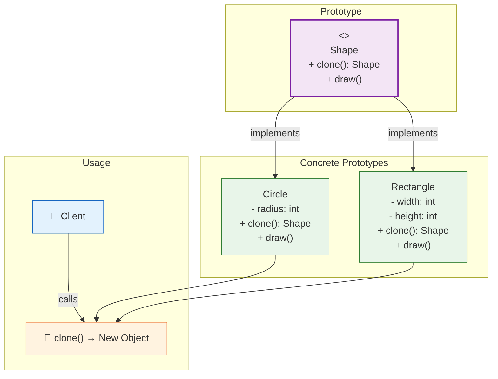

# 🧬 Prototype Pattern

## Cloning a Sheep Instead of Growing One

---

### 📖 The Story

Imagine you're a scientist. You've spent 10 years breeding the perfect sheep — fluffy wool, gentle eyes, and it sings lullabies. Yes, a singing sheep. It's your masterpiece. Now you want 100 more just like it.

Option A: Spend another 10 years breeding 100 sheep, hoping each one turns out as perfect. (Spoiler: they won't.)

Option B: **Clone the original.** Take the DNA, make a copy, and boom — instant perfect sheep #2. Then clone #2 to make #3, and so on.

That's the Prototype pattern.

Instead of creating objects from scratch (which might be expensive or complex), you **clone** an existing object. The original object is called the **prototype**. You make copies of it, and each copy is independent — you can modify it without affecting the original.

**In software terms: Specify the kinds of objects to create using a prototypical instance, and create new objects by copying this prototype.**

---

### 🖌️ The Diagram



---

### 🧠 How It Works

The Prototype pattern has three parts:

1. **Prototype Interface** — Declares the `clone()` method
2. **Concrete Prototype** — Implements `clone()` by copying itself
3. **Client** — Calls `clone()` on the prototype instead of using `new`

In Java, the `Cloneable` interface and `Object.clone()` method provide built-in support. But you can also write your own clone method for more control.

The key insight: **Cloning is often cheaper than creating from scratch.** If creating an object requires a database call, API request, or complex computation, it's faster to clone an existing one.

---

### 💻 The Code (Key Parts)

```java
interface Shape {
    Shape clone();    // The cloning method
    void draw();      // The business method
}

class Circle implements Shape {
    private int radius;
    
    public Circle(int radius) {
        this.radius = radius;
        // Imagine this constructor does heavy work...
    }
    
    // Private constructor used ONLY for cloning
    private Circle(Circle target) {
        this.radius = target.radius;
    }
    
    @Override
    public Shape clone() {
        return new Circle(this);  // Copy constructor
    }
    
    @Override
    public void draw() {
        System.out.println("⚪ Drawing a circle of radius " + radius);
    }
}

// Usage
Shape original = new Circle(10);
Shape copy = original.clone();  // No "new" keyword!
```

**What's happening?**
- `clone()` returns a new object with the same values
- The copy is independent — changing the copy doesn't affect the original
- The client doesn't need to know the concrete class (Circle, Rectangle, etc.)

---

### ✅ When to Use

- **When creating an object is expensive** (database call, API, complex computation)
- **When you want to avoid subclasses of a factory** to create objects
- **When you want to keep the number of classes small**
- **When objects have only a few different configurations**

### ❌ When NOT to Use

- **When objects are simple** — `new` is simpler than clone
- **When objects have circular references** — Cloning gets tricky
- **When you need deep copies of complex object graphs**
- **When the object has non-cloneable resources** (file handles, sockets)

### ⚖️ Pros vs Cons

| ✅ Pros | ❌ Cons |
|---------|--------|
| Cloning is faster than creating from scratch | Deep copying complex objects is hard |
| Hides concrete product classes from client | Circular references cause infinite loops |
| Can create objects at runtime without knowing their exact type | Objects with files/sockets need special handling |
| Reduce subclassing needed for factories | Cloneable interface in Java is quirky |

### 💡 Senior Wisdom

*"I used Prototype in a game where we had thousands of enemy units. Each unit had a complex initialization process — loading textures, calculating stats, setting up AI. Creating each one from scratch took 200ms. But cloning a prototype took 2ms. We created one 'Elite Orc' prototype, one 'Fire Mage' prototype, etc., and just cloned them. The game loaded 10x faster. Sometimes the fastest way to make something is to copy it."*