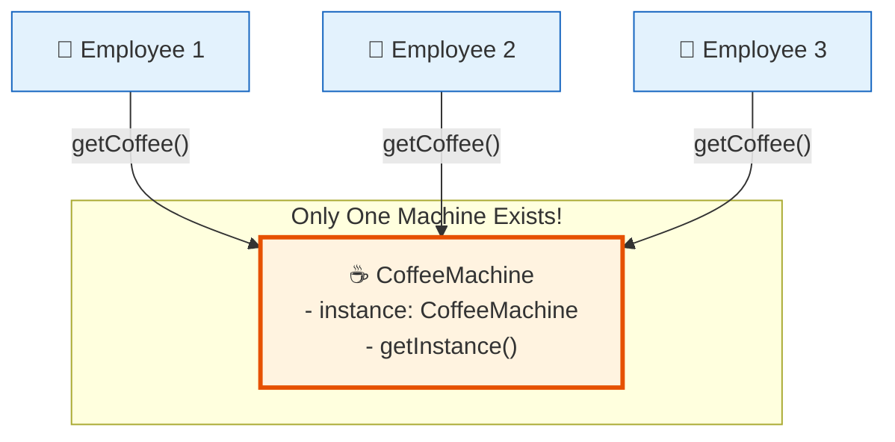

# 🏭 Singleton Pattern

## The Kingdom's One and Only Coffee Machine

---

### 📖 The Story

Picture this: You're working at a company with 200 employees. The management, in their infinite wisdom, decides to buy **one** coffee machine for the entire floor. Not two. Not three. Just one.

Now imagine if every time someone wanted coffee, they tried to create a *new* coffee machine. Suddenly there are 50 coffee machines in the break room, all plugged into the same outlet, all brewing different coffees. Chaos. The fire department gets called. Your boss is furious.

What you *actually* want is: **one coffee machine that everyone shares**. If it's already there, use it. If it's not, create it once. And make sure nobody accidentally creates a second one.

That's the Singleton pattern.

In software terms: **A Singleton ensures a class has only one instance and provides a global point of access to it.**

---

### 🖌️ The Diagram



---

### 🧠 How It Works

The Singleton pattern has three rules:

1. **Private constructor** — Nobody can use `new CoffeeMachine()` from outside. You can't just create one on your own.
2. **Static field** — The one and only instance is stored in a static variable. It lives with the class, not with any object.
3. **Static getter method** — The only way to get the instance. It checks: "Do I already have an instance? If yes, return it. If not, create it, store it, return it."

There are two flavors:
- **Eager Singleton** — Create the instance when the class loads (simple, always ready)
- **Lazy Singleton** — Wait until someone actually asks for it (saves memory if never used)

---

### 💻 The Code

```java
public class CoffeeMachine {
    // The one and only instance — created when class loads
    private static CoffeeMachine instance = new CoffeeMachine();
    
    // Private constructor — nobody can call "new CoffeeMachine()"
    private CoffeeMachine() {
        System.out.println("☕ Coffee machine installed! Ready to serve.");
    }
    
    // The only way to get the machine
    public static CoffeeMachine getInstance() {
        return instance;
    }
    
    public void makeCoffee() {
        System.out.println("☕ Brewing a fresh cup of coffee... Enjoy!");
    }
}
```

**What's happening here?**
- `private static CoffeeMachine instance = new CoffeeMachine();` — This runs once when the class is first loaded. One instance, forever.
- `private CoffeeMachine()` — The constructor is locked. No `new` allowed.
- `getInstance()` — The bouncer at the door. "Only one person allowed in, and they're already inside."

---

### ✅ When to Use

- **Configuration managers** — You want one config object for the whole app
- **Logging** — One logger that everyone writes to (so logs don't get mixed up)
- **Database connection pools** — One pool of connections, shared across the app
- **Thread pools** — One pool, many workers

### ❌ When NOT to Use

- **When you need multiple instances** — If you ever think "maybe I'll need two of these later," Singleton is wrong
- **In unit tests** — Singletons are hard to mock. They're like that stubborn friend who never changes
- **When it hides dependencies** — If you use Singletons everywhere, nobody knows what depends on what

### ⚖️ Pros vs Cons

| ✅ Pros | ❌ Cons |
|---------|--------|
| Guarantees one instance | Hard to unit test (can't mock easily) |
| Global access point | Creates hidden dependencies |
| Lazy initialization possible | Violates Single Responsibility Principle |
| Saves memory | Can cause issues in multithreaded apps |

### 💡 Senior Wisdom

*"I once worked on a project where the previous developer made EVERYTHING a Singleton. The logger? Singleton. The config? Singleton. The database connection? Singleton. The shopping cart? Singleton. Yes, a shopping cart. 500 users, one cart. People were buying each other's groceries. We called it 'The Community Shopping Experience.' Don't be that developer. Use Singleton when you need ONE of something, not when you're too lazy to pass objects around."*