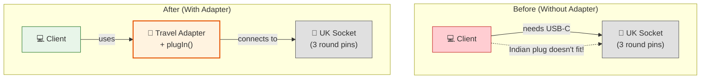

# 🔌 Adapter Pattern

## The International Traveler with the Wrong Plug

---

### 📖 The Story

Picture this: You're Rajesh. You live in India. You buy a fancy new laptop with an Indian plug — two flat pins. Life is good.

Then you fly to London for a conference. You get to your hotel room, jet-lagged and exhausted. You pull out your laptop charger and... *stare* at the wall socket.

The socket has three round holes. Your plug has two flat pins. They don't fit. Your laptop is at 5% battery. Your presentation is in 30 minutes.

What do you do?

You buy a **travel adapter**. A small plastic thing that:
- On one end: accepts your Indian plug (two flat pins)
- On the other end: fits into the UK socket (three round holes)

The adapter doesn't change your laptop. It doesn't change the socket. It just **bridges** them so they can work together.

That's the Adapter pattern.

**In software terms: Convert the interface of a class into another interface that clients expect. Adapter lets classes work together that couldn't otherwise because of incompatible interfaces.**

---

### 🖌️ The Diagram



---

### 🧠 How It Works

The Adapter pattern has three parts:

1. **Target** — The interface the client expects (e.g., USB-C charging)
2. **Adaptee** — The existing interface that needs adapting (e.g., UK socket)
3. **Adapter** — The bridge that makes them work together

There are two styles:

- **Object Adapter** (uses composition) — The adapter *has* an adaptee. More flexible.
- **Class Adapter** (uses inheritance) — The adapter *extends* the adaptee. Tighter coupling, less common.

In Java, **Object Adapter** is preferred because it's more flexible — you can pass any subclass of the adaptee.

---

### 💻 The Code (Key Parts)

```java
// Target interface — what the client expects
interface IndianCharger {
    void chargeWithTwoPins();
}

// Adaptee — the incompatible interface
class UKSocket {
    public void providePowerWithThreePins() {
        System.out.println("🔌 UK Socket: Providing power with 3 round pins.");
    }
}

// Adapter — makes them work together
class TravelAdapter implements IndianCharger {
    private UKSocket ukSocket;  // The adapter HAS the UK socket
    
    public TravelAdapter(UKSocket ukSocket) {
        this.ukSocket = ukSocket;
    }
    
    @Override
    public void chargeWithTwoPins() {
        // The adapter converts the call!
        System.out.println("🔌 Adapter: Converting 2-pin Indian plug → 3-pin UK socket...");
        ukSocket.providePowerWithThreePins();
    }
}

// Usage
IndianCharger charger = new TravelAdapter(new UKSocket());
charger.chargeWithTwoPins();  // Works! The adapter handled the conversion.
```

**What's happening?**
- The client calls `chargeWithTwoPins()` (the interface it knows)
- The adapter converts this to `providePowerWithThreePins()` (the socket's language)
- Nobody changes — they just communicate through the adapter

---

### ✅ When to Use

- **When you want to use an existing class, but its interface doesn't match what you need**
- **When you want to create a reusable class that cooperates with unrelated classes**
- **When you need to integrate legacy code with a new system**
- **When you're using a third-party library with a different interface**

### ❌ When NOT to Use

- **When you can modify both sides** — Just change the interface directly
- **When the interfaces are fundamentally incompatible** — No adapter can fix bad design
- **When adding an adapter makes things more complex than rewriting the class**

### ⚖️ Pros vs Cons

| ✅ Pros | ❌ Cons |
|---------|--------|
| Lets you reuse existing code | Adds another layer of indirection |
| Follows Open/Closed — you don't change existing code | Can make code harder to debug |
| Single Responsibility — adapter handles conversion | Sometimes simpler to just refactor |
| Great for legacy system integration | |

### 💡 Senior Wisdom

*"I once worked on a project where we had to integrate with 15 different payment gateways. Each had its own API — different method names, different parameter formats, different error codes. Instead of writing 15 different implementations, we created a PaymentAdapter interface. Each gateway had its own adapter. The rest of the code never knew which gateway it was talking to. When we added a 16th gateway, we just wrote one new adapter. 50 lines of code. The alternative? Rewriting hundreds of lines. Adapter is the unsung hero of enterprise software."*