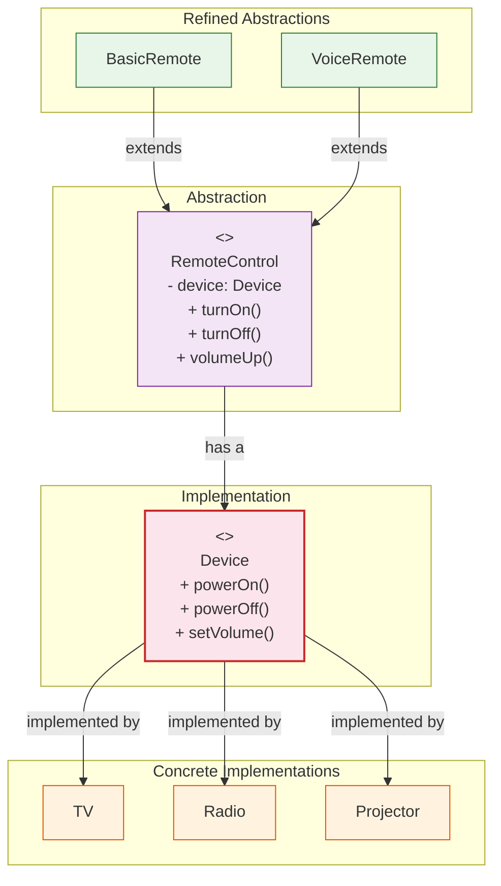

# 🌉 Bridge Pattern

## The TV and Its Remote Control

---

### 📖 The Story

Imagine you have a TV. Any TV — Samsung, LG, Sony. And you have a remote control. Any remote — basic, voice-controlled, smart.

Now think about this: If every TV manufacturer had to make a *unique* remote for *every* TV model, we'd have chaos. Samsung would make 50 different remotes. Sony would make 50 more. Every time a new TV came out, you'd need a new remote.

That's the *wrong* way — the **class explosion** way.

The right way? **Separate the TV from the remote.** A remote should work with *any* TV. A TV should work with *any* remote. They communicate through a standard interface — infrared signals, Bluetooth, whatever.

That's the Bridge pattern.

**In software terms: Decouple an abstraction from its implementation so the two can vary independently.**

---

### 🖌️ The Diagram



---

### 🧠 How It Works

The Bridge pattern has four parts:

1. **Abstraction** — The high-level control layer (RemoteControl)
2. **Refined Abstraction** — Variations of the control (BasicRemote, VoiceRemote)
3. **Implementor** — The interface for the implementation layer (Device)
4. **Concrete Implementor** — The actual devices (TV, Radio, Projector)

The key insight: **The abstraction HAS an implementor**. They're connected by composition, not inheritance. You can change either side independently.

Want a new remote? Add a new RefinedAbstraction. The devices don't change.
Want a new device? Add a new ConcreteImplementor. The remotes don't change.

This is what makes Bridge different from Adapter. Bridge is designed upfront. Adapter is retrofitted.

---

### 💻 The Code (Key Parts)

```java
// Implementor — what devices can do
interface Device {
    void powerOn();
    void powerOff();
    void setVolume(int percent);
}

// Concrete Implementors
class TV implements Device { /* ... */ }
class Radio implements Device { /* ... */ }

// Abstraction — what remotes can do
abstract class RemoteControl {
    protected Device device;  // ← The bridge! Remote HAS a device
    
    public abstract void turnOn();
    public abstract void turnOff();
}

// Refined Abstractions
class BasicRemote extends RemoteControl {
    public void turnOn() { device.powerOn(); }
    public void turnOff() { device.powerOff(); }
}

class VoiceRemote extends RemoteControl {
    public void turnOn() { 
        System.out.println("🎤 Voice command: Turn on");
        device.powerOn(); 
    }
}
```

**What's happening?**
- The remote *contains* a device (composition)
- You can mix and match: `new BasicRemote(tv)` or `new VoiceRemote(radio)`
- 2 remotes × 3 devices = 6 combinations. Without Bridge? 6 classes. With Bridge? 5 classes (2+3).

---

### ✅ When to Use

- **When you want to avoid a permanent binding between abstraction and implementation**
- **When both the abstractions and implementations should be extensible by subclassing**
- **When changes in the implementation should not affect the client**
- **When you have a "class explosion" of combinations**

### ❌ When NOT to Use

- **When there's only one implementation** — Bridge adds unnecessary complexity
- **When the abstraction and implementation don't vary independently** — They move together, so keep them together
- **When you're using a simple library** — Just call the methods directly

### ⚖️ Pros vs Cons

| ✅ Pros | ❌ Cons |
|---------|--------|
| No class explosion (n+m instead of n×m) | More complex design upfront |
| Abstraction and implementation are independent | Need to identify where to apply it early |
| Follows Open/Closed — both sides extensible | Can be overkill for simple scenarios |
| Clients see only the abstraction | |

### 💡 Senior Wisdom

*"I once worked on a graphics rendering engine. We had two 'abstractions' — 2D shapes and 3D shapes. And two 'implementations' — DirectX and OpenGL. Without Bridge, we'd need Shape2D_DirectX, Shape2D_OpenGL, Shape3D_DirectX, Shape3D_OpenGL = 4 classes. With Bridge, we had Shape2D, Shape3D, DirectXRenderer, OpenGLRenderer = 4 classes... wait, that's the same. But add Vulkan renderer and it becomes 6 vs 4. Add 3 more shapes and it's 15 vs 8. The Bridge wins every time the number of combinations grows."*