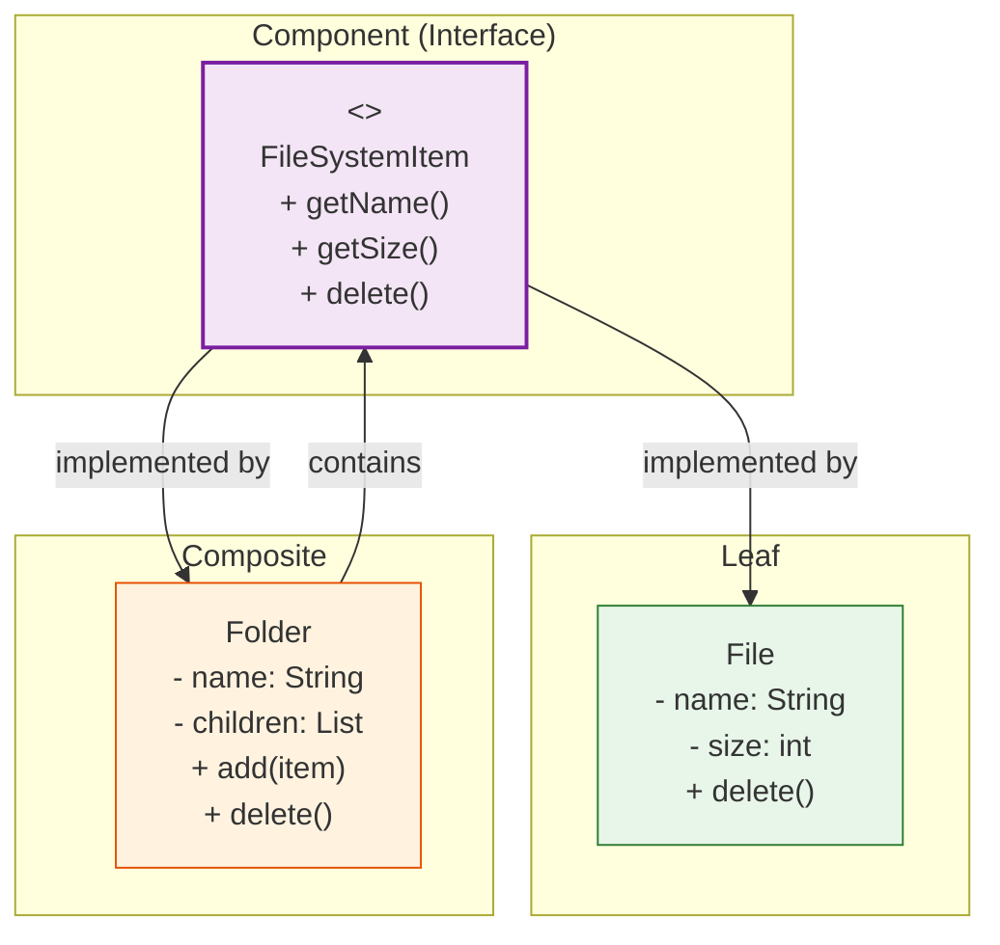

# 🌳 Composite Pattern

## The File System — Folders Inside Folders

---

### 📖 The Story

Think about your computer's file system. You have files — documents, images, videos. And you have folders. You can put files in folders. You can put folders inside other folders. You can put files in *those* folders.

Now, what does "delete" mean?
- If you delete a **file**, it's gone.
- If you delete a **folder**, everything inside it is gone too — files, sub-folders, everything.

The interesting part? **You don't care.** You just hit "delete" on *both* files and folders, and it works. The system treats them the same way. A file is a single thing. A folder is a group of things. But from the outside, they behave the same.

That's the Composite pattern.

**In software terms: Compose objects into tree structures to represent part-whole hierarchies. Composite lets clients treat individual objects and compositions of objects uniformly.**

---

### 🖌️ The Diagram



---

### 🧠 How It Works

The Composite pattern has three parts:

1. **Component** — The common interface for both leaf and composite objects
2. **Leaf** — A single object (a file). Implements the component interface directly
3. **Composite** — A group of objects (a folder). Contains children, also implements the same interface

The magic: **Both Leaf and Composite implement the same interface.** So the client can call `delete()` on a file OR a folder, and it just works. The folder's `delete()` recursively deletes all children.

This creates a tree structure where every node can be treated uniformly.

---

### 💻 The Code (Key Parts)

```java
// Component — common interface
interface FileSystemItem {
    void delete();
    int getSize();
}

// Leaf — a single file
class File implements FileSystemItem {
    private String name;
    private int size;
    
    public void delete() {
        System.out.println("Deleting file: " + name);
    }
}

// Composite — a folder that contains items
class Folder implements FileSystemItem {
    private List<FileSystemItem> children = new ArrayList<>();
    
    public void add(FileSystemItem item) {
        children.add(item);
    }
    
    public void delete() {
        // Delete all children first, then the folder
        for (FileSystemItem item : children) {
            item.delete();  // ← Recursive! If a child is a folder, it deletes its children too
        }
        System.out.println("Deleting folder: " + name);
    }
}
```

**What's happening?**
- `Folder` implements the same interface as `File`
- `Folder.delete()` calls `delete()` on each child — recursively
- The client doesn't know if it's deleting a file or a folder. It just calls `delete()`

---

### ✅ When to Use

- **When you have tree structures** (file systems, UI components, organization charts)
- **When you want clients to treat individual and composite objects the same way**
- **When you want to add new component types without changing existing code**

### ❌ When NOT to Use

- **When the tree structure is flat** (no nesting needed)
- **When leaf and composite behaviors are fundamentally different**
- **When you need to restrict certain operations on certain components**

### ⚖️ Pros vs Cons

| ✅ Pros | ❌ Cons |
|---------|--------|
| Makes client code simple (no if-else for leaf vs composite) | Can make the design overly general |
| Easy to add new component types | Sometimes you want to restrict operations |
| Natural fit for tree structures | Leaf and composite are treated the same (might not always make sense) |

### 💡 Senior Wisdom

*"I used Composite to build a UI framework. Every UI element — Button, TextField, Panel — implemented a `UIComponent` interface. Panel was a composite that could hold other components. Rendering was recursive: `panel.render()` called `render()` on all its children. Adding a new component type was trivial. The whole system was built on this one pattern. It's elegant when the problem is naturally a tree."*