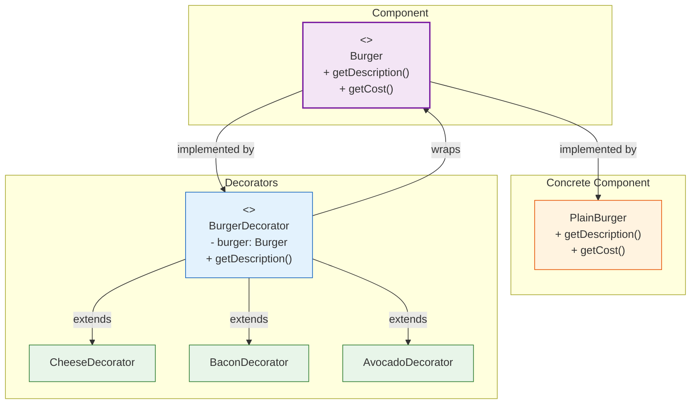

# 🎄 Decorator Pattern

## Adding Toppings to a Plain Burger

---

### 📖 The Story

You walk into a burger joint. "I'll have a burger," you say. The chef hands you a plain bun with a patty. It's... fine. But you want more.

"Can I add cheese?" → 🧀 Now it's a cheeseburger.
"Can I add bacon?" → 🥓 Now it's a bacon cheeseburger.
"Can I add avocado?" → 🥑 Now it's a California bacon cheeseburger.

Each addition **wraps** the previous burger. The original burger is still there — you've just **decorated** it with extras. You didn't change the burger. You added things *around* it.

That's the Decorator pattern.

The key difference from inheritance? With inheritance, you'd need `Burger`, `CheeseBurger`, `BaconCheeseBurger`, `AvocadoBaconCheeseBurger` — the number explodes. With Decorator, each topping is a class that *wraps* the previous one.

**In software terms: Attach additional responsibilities to an object dynamically. Decorators provide a flexible alternative to subclassing for extending functionality.**

---

### 🖌️ The Diagram



---

### 🧠 How It Works

The Decorator has four parts:

1. **Component** — The interface for objects that can have responsibilities added
2. **Concrete Component** — The base object you're decorating (PlainBurger)
3. **Decorator** — An abstract class that wraps a Component and delegates to it
4. **Concrete Decorator** — Adds specific behavior before/after delegating to the wrapped component

The magic: **Decorators wrap other decorators.** You stack them. `new CheeseDecorator(new BaconDecorator(new PlainBurger()))`. Each decorator adds its own behavior, then passes the call down the chain.

---

### 💻 The Code (Key Parts)

```java
// Component
interface Burger {
    String getDescription();
    double getCost();
}

// Concrete Component
class PlainBurger implements Burger {
    public String getDescription() { return "Plain burger"; }
    public double getCost() { return 5.00; }
}

// Decorator (abstract)
abstract class BurgerDecorator implements Burger {
    protected Burger burger;  // ← the wrapped object
    
    public BurgerDecorator(Burger burger) {
        this.burger = burger;
    }
}

// Concrete Decorators
class CheeseDecorator extends BurgerDecorator {
    public CheeseDecorator(Burger burger) { super(burger); }
    
    public String getDescription() { 
        return burger.getDescription() + " + cheese"; 
    }
    public double getCost() { 
        return burger.getCost() + 1.50; 
    }
}

// Usage
Burger myBurger = new CheeseDecorator(
    new BaconDecorator(
        new PlainBurger()
    )
);
System.out.println(myBurger.getDescription());  // "Plain burger + bacon + cheese"
```

**What's happening?**
- Each decorator adds its own description/cost
- Then delegates to the wrapped object for the rest
- You build a stack: PlainBurger ← BaconDecorator ← CheeseDecorator

---

### ✅ When to Use

- **When you need to add responsibilities to objects dynamically without affecting other objects**
- **When extending via subclassing leads to class explosion** (too many combinations)
- **When you want to add/remove responsibilities at runtime**
- **When you want to keep each responsibility in its own class**

### ❌ When NOT to Use

- **When the base object is simple and rarely changes** — Just use inheritance
- **When the order of decoration matters and different orders produce different results** (can get confusing)
- **When many decorators are small and trivial** — Too many small classes can be worse than one big class

### ⚖️ Pros vs Cons

| ✅ Pros | ❌ Cons |
|---------|--------|
| More flexible than inheritance | Many small similar classes |
| Add/remove responsibilities at runtime | Can get confusing with many layers |
| Each decorator does one thing | Order of decorators can matter |
| Composable — stack them how you want | Debugging through multiple layers is hard |

### 💡 Senior Wisdom

*"The Java I/O library is a classic example of Decorator gone wild. You write `new BufferedReader(new InputStreamReader(new FileInputStream("file.txt")))`. It works, but it's ugly. I once saw a codebase where someone stacked 7 decorators. Nobody knew what the final behavior was. Use Decorator, but don't go overboard. If you need more than 3-4 levels, consider wrapping the whole stack in a factory method."*