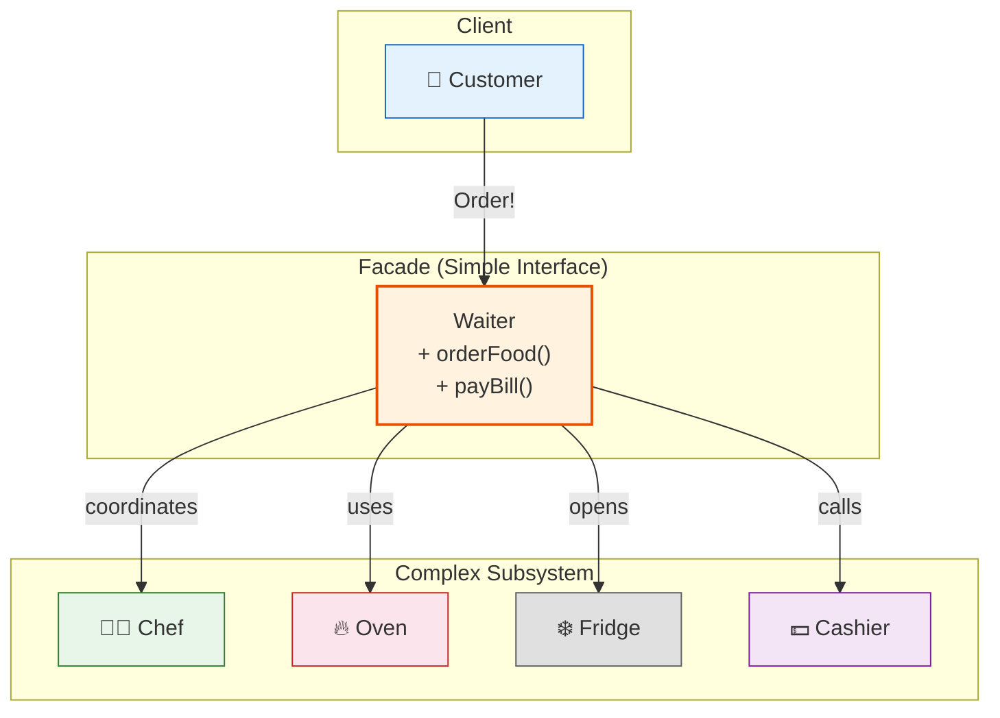

# 🏪 Facade Pattern

## The Waiter Who Handles the Complicated Kitchen

---

### 📖 The Story

You're at a fancy restaurant. You're hungry. You want food. What do you do?

Option A: Walk into the kitchen, find the chef, ask him to fire up the grill, check the fridge for ingredients, get the plates from the cabinet, coordinate with the sous-chef, make sure the salad is prepped...

Option B: **Tell the waiter.** "I'll have the spaghetti, please."

The waiter handles everything. They talk to the chef, coordinate the kitchen, bring you your food. You don't care about the chaos behind the kitchen doors. You just want spaghetti.

That's the Facade pattern. The waiter is the **facade** — a simple, friendly face hiding a complex system.

**In software terms: Provide a unified interface to a set of interfaces in a subsystem. Facade defines a higher-level interface that makes the subsystem easier to use.**

---

### 🖌️ The Diagram



---

### 🧠 How It Works

The Facade pattern is simple:

1. **Subsystem classes** — The complex system with many moving parts
2. **Facade** — A single class that wraps the subsystem and provides simple methods

The client talks to the Facade. The Facade talks to the subsystem. The client never talks to the subsystem directly.

This reduces coupling. If the kitchen changes (new oven, new menu), the customer doesn't care. As long as the waiter still brings food, everything is fine.

---

### 💻 The Code (Key Parts)

```java
// Complex Subsystem
class Oven { void preheat() { /* ... */ } void bake() { /* ... */ } }
class Chef { void prepareIngredients() { /* ... */ } void cook() { /* ... */ } }
class Cashier { void processPayment() { /* ... */ } }

// Facade
class Waiter {
    private Chef chef = new Chef();
    private Oven oven = new Oven();
    private Cashier cashier = new Cashier();
    
    public void orderFood() {
        chef.prepareIngredients();
        oven.preheat();
        chef.cook();
        oven.bake();
        System.out.println("🍝 Here's your spaghetti!");
    }
    
    public void payBill() {
        cashier.processPayment();
    }
}

// Client
Waiter waiter = new Waiter();
waiter.orderFood();  // One call. Everything else is hidden.
waiter.payBill();    // One call. Done.
```

---

### ✅ When to Use

- **When you want to provide a simple interface to a complex subsystem**
- **When there are many dependencies between clients and the subsystem**
- **When you want to layer your system** (Facade as entry point to each layer)
- **When you want to decouple clients from implementation details**

### ❌ When NOT to Use

- **When the subsystem is already simple** — Don't add unnecessary layers
- **When clients NEED fine-grained access to the subsystem** — Let them bypass the facade
- **When the facade becomes a god object** — Don't put everything in one class

### ⚖️ Pros vs Cons

| ✅ Pros | ❌ Cons |
|---------|--------|
| Makes complex systems easy to use | Can become a god object if overused |
| Reduces coupling between clients and subsystem | Clients may bypass it anyway |
| Provides a clear entry point for each layer | Adds one more layer of indirection |

### 💡 Senior Wisdom

*"I once joined a project where the previous team had built a 'Smart Home' system with 47 different APIs — lights, thermostat, security cameras, door locks, sprinklers. Each had its own interface. Setting 'Away Mode' required calling 12 different methods. I created a `HomeAutomationFacade` with one method: `setAwayMode()`. It called all 12 internally. The mobile app team loved me. The backend team loved me. 47 APIs became 5 facades. Sometimes the best code is the code you don't make the client write."*