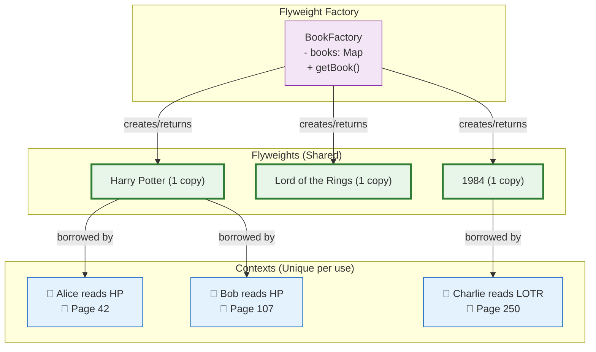

# 🪶 Flyweight Pattern

## The Library That Shares Books Instead of Owning Them

---

### 📖 The Story

Imagine a town of 1,000 people. Everyone loves reading Harry Potter. If each person buys their own copy, that's 1,000 copies of the same book. 1,000 trees cut down. 1,000 printings. 1,000 deliveries. Wasteful.

Now imagine a **library**. The library buys ONE copy of Harry Potter. Anyone who wants to read it borrows the same copy. The book's *content* is shared. Each person just brings their own *context* — their bookmark, their reading glasses, their cozy chair.

That's the Flyweight pattern.

The key insight: **intrinsic state** (the book's content) is shared. **Extrinsic state** (who's reading it, where, which page) is unique to each use.

**In software terms: Use sharing to support large numbers of fine-grained objects efficiently. A flyweight is a shared object that can be used in multiple contexts simultaneously.**

---

### 🖌️ The Diagram



---

### 🧠 How It Works

The Flyweight has four parts:

1. **Flyweight** — The shared object (the book)
2. **Concrete Flyweight** — Implements the Flyweight, stores *intrinsic* state
3. **Flyweight Factory** — Creates and manages flyweights. Ensures sharing.
4. **Client** — Uses flyweights. Stores *extrinsic* state separately.

The key: **Never create the same thing twice.** The factory checks if it already exists. If yes, return it. If no, create it, store it, return it.

---

### 💻 The Code (Key Parts)

```java
// Flyweight — the shared book
class Book {
    private String title;  // Intrinsic — same for everyone
    
    public Book(String title) {
        this.title = title;
        // Heavy loading simulated here
    }
    
    public void read(String readerName, int page) {
        // readerName and page are extrinsic — unique to each reader
        System.out.println(readerName + " reading " + title + " at page " + page);
    }
}

// Flyweight Factory
class BookFactory {
    private Map<String, Book> books = new HashMap<>();
    
    public Book getBook(String title) {
        if (!books.containsKey(title)) {
            books.put(title, new Book(title));  // Create once
        }
        return books.get(title);  // Return shared instance
    }
    
    public int getTotalBooksCreated() {
        return books.size();
    }
}

// Usage
BookFactory library = new BookFactory();
Book hp1 = library.getBook("Harry Potter");  // Created
Book hp2 = library.getBook("Harry Potter");  // REUSED — same object!
System.out.println(hp1 == hp2);  // true!
```

**What's happening?**
- The library keeps a map of books by title
- If the book already exists, return the existing one
- `hp1` and `hp2` are the SAME object in memory
- The extrinsic state (reader name, page) is passed separately

---

### ✅ When to Use

- **When you have a large number of objects** (thousands or more)
- **When most of an object's state can be extrinsic** (shared)
- **When creating many objects would use too much memory**
- **When the same objects are used in many different contexts**

### ❌ When NOT to Use

- **When objects are already small** — Overhead of factory isn't worth it
- **When objects don't share state** — No sharing opportunity means no benefit
- **When performance isn't an issue** — Premature optimization
- **When the extrinsic state management becomes too complex**

### ⚖️ Pros vs Cons

| ✅ Pros | ❌ Cons |
|---------|--------|
| Reduces memory usage significantly | Adds complexity (factory, state separation) |
| Reduces number of objects | Extrinsic state management can be tricky |
| Sharing improves performance | If not designed well, can cause bugs from shared state |

### 💡 Senior Wisdom

*"I used Flyweight in a text editor where every character was an object. With 10,000 characters on screen, that's 10,000 objects. Each character object stores font, size, color, bold, italic — that's a lot of memory. Flyweight: each UNIQUE character (A, B, C...) is one object. The position on screen is extrinsic. 10,000 characters became 95 objects (all printable ASCII chars). Memory dropped from 50MB to 500KB. When you need to save memory, Flyweight is your friend. But don't use it until you've measured and found the pain point."*