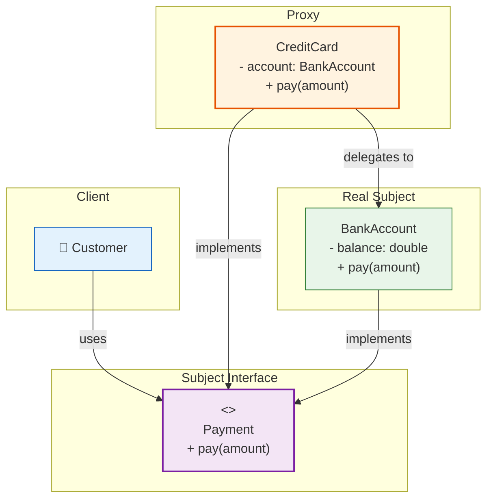

# 🛡️ Proxy Pattern

## The Credit Card — Proxy for Real Money

---

### 📖 The Story

When you buy something with a credit card, you're not handing over real money. You're handing over a **stand-in** for money. The credit card represents your bank account. The merchant swipes it, the bank checks if you have funds, and *then* the real money moves (later). But at the moment of purchase, the card acts as a **proxy** for the actual cash.

The card:
- Looks like money (you can pay with it)
- Is lighter to carry than cash
- Can add extra features (rewards, insurance)
- Only accesses the real money when needed (lazy initialization)

That's the Proxy pattern. A proxy is a stand-in object that controls access to the real object. It can add behavior before or after delegating to the real object.

**In software terms: Provide a surrogate or placeholder for another object to control access to it.**

---

### 🖌️ The Diagram



---

### 🧠 How It Works

The Proxy has four parts:

1. **Subject** — The interface both the real object and proxy implement
2. **Real Subject** — The actual object doing the work
3. **Proxy** — The stand-in that controls access to the real subject
4. **Client** — Uses the proxy (thinks it's using the real subject)

There are several flavors of Proxy:
- **Virtual Proxy** — Delays creation of expensive objects (lazy loading)
- **Protection Proxy** — Controls access permissions
- **Remote Proxy** — Represents an object in a different address space
- **Logging Proxy** — Logs calls before delegating
- **Caching Proxy** — Caches results to avoid repeated work

---

### 💻 The Code (Key Parts)

```java
// Subject
interface Image {
    void display();
}

// Real Subject — expensive to create
class HighResolutionImage implements Image {
    private String filename;
    
    public HighResolutionImage(String filename) {
        this.filename = filename;
        loadFromDisk();  // Expensive!
    }
    
    private void loadFromDisk() {
        System.out.println("📀 Loading huge image from disk...");
    }
    
    public void display() {
        System.out.println("🖼️ Displaying: " + filename);
    }
}

// Proxy — lazy loads the real image
class ImageProxy implements Image {
    private String filename;
    private HighResolutionImage realImage;  // Not created yet!
    
    public ImageProxy(String filename) {
        this.filename = filename;
        // Notice: NO loading here!
    }
    
    public void display() {
        if (realImage == null) {
            realImage = new HighResolutionImage(filename);  // Created only when needed
        }
        realImage.display();
    }
}
```

**What's happening?**
- `ImageProxy` looks like an `Image` (same interface)
- The real image is NOT loaded when the proxy is created
- It's loaded only when `display()` is actually called

---

### ✅ When to Use

- **Virtual Proxy** — When creating an object is expensive and you want to defer it
- **Protection Proxy** — When you need to control access based on permissions
- **Logging Proxy** — When you want to log all operations on an object
- **Caching Proxy** — When you want to cache results
- **Remote Proxy** — When the real object exists on a different server

### ❌ When NOT to Use

- **When the proxy adds complexity without benefit**
- **When the real object is cheap to create** — Just create it directly
- **When you don't need intermediate control**

### ⚖️ Pros vs Cons

| ✅ Pros | ❌ Cons |
|---------|--------|
| Control access to the real object | Adds another layer of indirection |
| Can add behavior (logging, caching, auth) | Can make debugging harder |
| Lazy initialization improves performance | The proxy and real subject must implement same interface |
| Follows Open/Closed principle | |

### 💡 Senior Wisdom

*"I used a Virtual Proxy for a photo gallery app. Users had albums with 500+ photos. Loading all photos at once took 30 seconds. Instead, each photo was a `PhotoProxy`. Only the thumbnail loaded immediately. The full-resolution image loaded only when the user clicked 'view'. Start time dropped to 2 seconds. The difference between a slow app and a fast app is often just knowing WHEN to do the work. Proxy lets you defer the work until the last possible moment."*